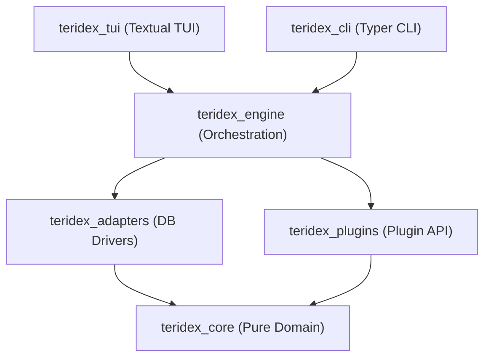

# Contributing to Teridex 📟

Thank you for your interest in contributing to **Teridex**! We welcome and appreciate contributions of all kinds, whether you are fixing a bug, adding database drivers, improving the TUI/CLI, or updating documentation.

This guide details our local development setup, code standards, test architecture, and submission workflow.

---

## 🚀 Setup & Installation

To develop Teridex locally, you will need:
- **Python >= 3.13**
- The [**`uv`**](https://docs.astral.sh/uv/) package manager (`brew install uv` or see [uv installation guide](https://docs.astral.sh/uv/))

Clone the repository and sync the workspace virtual environment and dependencies:

```bash
git clone https://github.com/salvatorecorvaglia/teridex.git
cd teridex
./scripts/dev.sh
```

> [!NOTE]
> The `./scripts/dev.sh` script runs `uv sync --all-extras --dev` under the hood.

---

## 🛠️ Day-to-Day Commands

We provide utility scripts inside the `scripts/` directory to run formatting, type checks, and test suites.

| Task | Command | Description |
| :--- | :--- | :--- |
| **All Gates** | `./scripts/check.sh` | Runs formatting check, lint check, type check, and unit tests in one command. |
| **Format & Autofix** | `./scripts/fmt.sh` | Formats Python code and autofixes auto-resolvable lint issues. |
| **Lint & Type Check** | `./scripts/lint.sh` | Performs formatting checks, Ruff lint checks, and strict Mypy checks. |
| **Unit Tests** | `./scripts/test.sh` | Runs the offline test suite and outputs terminal coverage. |
| **Start Docker DBs** | `docker compose -f docker/docker-compose.yml up -d` | Spins up local PostgreSQL and MySQL instances. |
| **Integration Tests** | `TERIDEX_TEST_MARKERS=integration ./scripts/test.sh` | Executes integration tests. Automatically spins up containerized DBs via `testcontainers` if Docker is running, or uses manual instances if `TERIDEX_PG_DSN` / `TERIDEX_MYSQL_DSN` are set. |


> [!TIP]
> The `./scripts/check.sh` script forwards additional arguments directly to `pytest`.
> For example: `./scripts/check.sh -k schema_tree -v` will run the full lint and type stacks, and then execute only the tests matching `schema_tree` in verbose mode.

> [!NOTE]
> When `keymap = "vim"` is active in the configuration, the TUI Help Modal dynamically groups and categorizes standard global bindings vs. Vim navigation bindings. Refer to `tests/tui/test_help_modal.py` to see how dynamic categorization is verified.

---

## 📐 Package Architecture & Layering

Teridex follows a clean, layered architecture with strict dependency boundaries:



> [!IMPORTANT]
> **Layering Rule**: Inner packages must never depend on outer packages. Specifically, `teridex_core` must depend on zero internal packages. Outer packages (like `teridex_tui` and `teridex_cli`) may depend on inner packages, but never vice versa. This boundary is strictly enforced by `mypy --strict`.

---

## 🧪 Test Architecture & Coverage

The test suite mirrors our layered package structure:

*   **TUI & UI Component Tests** (`tests/tui/`): Covers screen and widget behavior, rendering states, help modals, schema tree displays, and vim keymap behavior (e.g., `test_app_smoke.py`, `test_schema_tree.py`, `test_results_pane.py`).
*   **CLI Command Surface Tests** (`tests/cli/`): Asserts command-line argument/option behavior, DSN constraints, config overrides, and clean error exit handling (e.g., `test_main.py`).
*   **Adapter Conformance Tests** (`tests/adapters/`): Verifies database driver implementations. All adapters must pass the shared conformance scenarios located in `tests/adapters/_conformance.py`.
*   **Engine Execution & Pool Orchestration** (`tests/engine/`): Tests transaction boundaries, `QueryExecutor` flow, `ConnectionPool` concurrency, and `QueryHistory` persistence.
*   **Core Logic & Infrastructure** (`tests/core/`): Tests dependency injection (`test_di.py`), JSON/structured logging formatters, custom configuration layers (`test_config.py`), and the event bus (`test_events.py`).
*   **Plugin Lifecycle** (`tests/plugins/`): Verifies API hooks, plugin load discovery, and context isolation.

### Code Coverage

> [!WARNING]
> The project enforces a **minimum 70% branch coverage** gate (`fail_under = 70` in `pyproject.toml`).
> Running `./scripts/test.sh` locally generates a `term-missing` coverage report. Please ensure your contributions include tests that maintain or improve coverage.

---

## 🎨 Coding Standards

To maintain predictability, performance, and robustness, all code submissions must adhere to the following standards:

1.  **Strict Static Typing**: Mypy strict mode is enabled across the codebase (configured via `mypy.ini`). All public and private functions must have complete type signatures (with relaxed constraints for test functions in `tests/`).
2.  **Formatting and Styling**: Standardized via **Ruff** (line length: 100). Run `./scripts/fmt.sh` before staging commits.
3.  **Async-First Event Loop**: Never execute blocking I/O operations directly within the TUI event loop or database adapters.
4.  **No Silent Exceptions**: Do not suppress exceptions silently. Every catch block must log, wrap, or re-raise appropriately.
5.  **Plugin Event Subscriptions**: Always register handlers via `PluginContext.subscribe` (which tracks subscriptions locally) instead of calling the event bus directly. This prevents memory leaks and orphaned tasks when plugins are dynamically unloaded.
6.  **Adapter Locking Guidelines**: When implementing or editing adapters with blocking interfaces (such as DuckDB), ensure all operations that touch connection handles are synchronized under the adapter's `self._lock` and offloaded using `asyncio.to_thread`.
7.  **Database Statement Classification**: Inspect prepared statement attributes (e.g., `stmt.get_attributes()` in `asyncpg`) to differentiate query execution types (DQL/DML) instead of parsing raw string prefixes. This ensures robust handling of comments and `RETURNING` clauses.
8.  **Small, Composed Modules**: Prefer composition over inheritance. Keep modules small and highly focused.
9.  **EditorConfig**: We ship an `.editorconfig` specifying UTF-8, LF, and 4-space indentation (2-space for configuration formats like YAML, TOML, and JSON). Ensure your editor configuration honors these guidelines.
10. **Async Context Manager**: `AbstractAdapter` implements async context manager support (`__aenter__` and `__aexit__`) which automatically invokes `close()`. Use `async with adapter:` blocks where applicable to ensure cleanup when executing commands or in tests.

---

## 🔌 Adding a Database Adapter

If you are implementing support for a new database, follow these steps:

1.  Create a subclass of `AbstractAdapter` in `src/teridex_adapters/<name>_adapter.py`.
2.  Define the class variables `name: ClassVar[str]` and `schemes: ClassVar[tuple[str, ...]]`.
3.  Implement the required methods: `_do_connect`, `_do_close`, `ping`, `execute`, `stream`, `begin`, and `introspect`.
4.  Register your new adapter class in `src/teridex_adapters/registry.py::_build_default`.
5.  Add a parametrized conformance test under `tests/adapters/` using the shared scenarios in `tests/adapters/_conformance.py`.

---

## 🚀 Pull Request Workflow

1.  **Fork & Branch**: Fork the repository and create a feature branch off of `main` (e.g., `feature/my-db-adapter`).
2.  **Develop**: Implement your changes and write unit tests to cover them.
3.  **Lint & Format**: Run `./scripts/fmt.sh` to tidy your code.
4.  **Validate Locally**: Run `./scripts/check.sh` to ensure formatting, types, and tests all pass locally.
5.  **Submit PR**: Open a pull request against the `main` branch. Provide a clear description of the problem solved and the implementation details.

---

## 📦 Releasing

Releases are automated via GitHub Actions (`.github/workflows/release.yml`) when a version tag is pushed. To prepare and cut a release:

1.  Update `CHANGELOG.md` (graduate the `[Unreleased]` stanza to the new version).
2.  Bump `version = "x.y.z"` in the root `pyproject.toml` and `__version__` in `src/teridex_core/__init__.py`.
3.  Run `uv sync --all-extras --dev` to refresh `uv.lock`.
4.  Run `./scripts/check.sh` and ensure it exits `0`.
5.  Commit changes to `main` and push.
6.  Create and push a version tag:
    ```bash
    git tag vx.y.z
    git push origin vx.y.z
    ```

---

## 📜 Code of Conduct

Please maintain a respectful, supportive, and professional tone in all communication (issues, PR reviews, commit logs).

---

Happy coding! 📟
